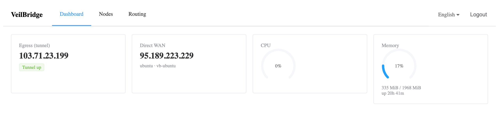

# VeilBridge

> A modern control panel for **OpenWrt** routers, built around VPN and
> selective routing. One clean UI instead of SSH and hand-edited configs.

VeilBridge is an open-source control plane for OpenWrt routers. It runs as a
single lightweight Go binary on the router itself and exposes a clean web UI
(Vue + Element Plus) on top of a platform-agnostic API.

The UI never talks to `uci`, `ubus`, or `nftables` directly — all OS specifics
live behind **adapters**. The goal is the feature level of a commercial router
OS, on any hardware that runs OpenWrt, plus honest domain-based tunnel routing
and proof of where your traffic actually leaves.



## Status

🧪 **`v0.1` released; `v0.2` in development on `main`.** Everything below is
verified on real hardware — an x86 OpenWrt VM and a Cudy WR3000S router — not
on a developer's laptop.

**In the released binaries (`v0.1.1`):** the tunnel comes up through the kernel
engine, `awg0` appears, and the dashboard confirms traffic egresses through it
by comparing egress IPs rather than trusting a `200 OK`.

**On `main`, not yet released:** the platform layer — configuration changes go
through a transaction that undoes itself if nobody confirms (proven by
deliberately cutting the router's own management link and watching it come
back), device capabilities the UI branches on, a live update stream, and a
rebuilt panel with a dashboard that reports model, firmware, memory and the
flash space that actually runs out first.

The first router-network screens are on `main` too: the uplink (connection
type, addresses, DNS servers) and the local network (router address, address
handout, lease time, and reserving an address for a device straight from the
client table). Every change is staged, shown as a before/after diff and applied
through the self-reverting transaction.

VeilBridge still does **not** manage firewall zones, port forwarding, static
routes, Wi-Fi or clients — keep LuCI around for those. See [Install](#install)
for the release binaries and the [roadmap](#roadmap) for what is next.

## Features (v0.1)

- **Import VPN configs** — AmneziaWG config files (obfuscation params included)
- **Exit node list** — your gateways with live handshake status
- **One-click exit switch** — change the active exit node from the UI
- **Dashboard** — WAN IP, tunnel egress IP, tunnel status, CPU / RAM / uptime
- **Routing control** — choose which domains/subnets go through the tunnel vs direct (nftables)
- **Path-aware checks** — verify traffic *actually* egresses through the tunnel, by comparing the egress IP, not by trusting `200 OK`
- **13 languages** — UI localized (full en/ru, the rest fall back to English)

### Added on `main` since `v0.1.1`

- **Safe apply** — a dangerous change is applied with a confirmation window; no
  confirmation, and the device restores the previous settings by itself
- **Capabilities** — the panel hides what the hardware cannot do and says why,
  instead of showing empty sections (a board with no radio has no Wi-Fi menu)
- **Live updates** — one event stream instead of polling ten tiles
- **Device vitals** — model, firmware, kernel, load, memory and writable space,
  with a short history kept in RAM only (nothing is written to flash)
- **Internet (uplink) screen** — DHCP, static or PPPoE, staged, shown as a diff
  in the panel's own words, then applied through the same transaction; if the
  panel stops answering mid-change, it says so instead of waiting silently
- **Local network screen** — router address, address handout and lease time,
  the clients currently holding an address, and reserved addresses

## Roadmap

| Version | Highlights | Status |
| --- | --- | --- |
| `v0.1` | AmneziaWG engine, own routing, dashboard, OpenWrt adapter | ✅ released |
| `v0.2` | Platform layer (uci/ubus) with safe apply + rollback, capabilities, live updates, rebuilt panel, router network | 🟡 on `main`: platform layer, panel, uplink and local network/DHCP done; firewall and static routes in progress |
| `v0.3` | Devices & Wi-Fi; exit-node policies, health-check failover | planned |
| `v0.4` | FakeIP and domain routing; DNS with per-device profiles and filters | planned |
| `v0.5+` | App platform and market (VLESS/Xray, auto-bypass as apps), VPN servers, QoS, remote access | planned |

## Architecture

```text
   Web UI (Vue + Element Plus)
            │  REST / JSON
            ▼
   veilbridged  (single Go binary)
   ├─ Router Core API        ← the only contract the UI sees
   ├─ embedded UI (go:embed)
   ├─ managers (interfaces)  ← VPN / Routing / Network / System
   ├─ apply transaction      ← snapshot → commit → confirm or auto-revert
   └─ VPN engines            ← AmneziaWG (Xray-core later)
            │
            ▼
      OpenWrt adapter     ← uci / ubus / nftables / procd live here only
```

The adapter boundary is not decoration: it is what keeps `uci` out of the API
and the UI, and it is where a second platform would plug in if the project ever
needs one.

## Tech stack

- **Backend / agent:** Go (single static binary, cross-compiled for x86 / ARM)
- **Frontend:** Vue 3 + Element Plus (built to static assets, embedded into the binary)
- **VPN:** [amneziawg-go](https://github.com/amnezia-vpn/amneziawg-go) (MIT); [Xray-core](https://github.com/XTLS/Xray-core) (MPL-2.0) from v0.5

## Install

Grab a static binary from the
[latest release](https://github.com/veilbridge-os/veilbridge/releases/latest) —
no runtime, no dependencies, the web UI is inside the binary:

Run this **on the router** (`ssh root@192.168.1.1`):

```sh
wget -qO- https://raw.githubusercontent.com/veilbridge-os/veilbridge/main/scripts/install.sh | sh
```

The script picks the build for your CPU **and for your package manager**,
verifies its SHA-256 checksum and installs it. OpenWrt 25.12 replaced `opkg`
with `apk`, so every release ships both formats: `.ipk` for 24.10 and earlier,
`.apk` for 25.12 and later. Prefer to do it by hand? That is the same two steps:

```sh
# x86_64 -> amd64, aarch64 -> arm64
ARCH=arm64
# OpenWrt <= 24.10: EXT=ipk. OpenWrt >= 25.12: EXT=apk.
EXT=$(command -v apk >/dev/null && echo apk || echo ipk)
BASE=https://github.com/veilbridge-os/veilbridge/releases/latest/download

wget -O "veilbridge_$ARCH.$EXT" "$BASE/veilbridge_$ARCH.$EXT"
wget -O SHA256SUMS "$BASE/SHA256SUMS"
# busybox sha256sum has no --ignore-missing: check exactly the one line,
# otherwise you verify nothing and never notice.
grep " veilbridge_$ARCH.$EXT$" SHA256SUMS > one.sum && sha256sum -c one.sum

# apk: the file is not signed by a repository key (a signed feed is on the
# roadmap), so it has to be allowed explicitly — the checksum above is the
# guarantee that matters.
[ "$EXT" = apk ] && apk add --allow-untrusted "./veilbridge_$ARCH.apk" \
                 || opkg install "./veilbridge_$ARCH.ipk"
```

The package installs `/usr/bin/veilbridged`, a procd service
(`/etc/init.d/veilbridge`, enabled on boot) and an owner-only `/etc/veilbridge`.
Finish the two steps it prints:

```sh
veilbridged -set-password '<choose-a-password>'
/etc/init.d/veilbridge start
```

Then open `http://<router-ip>:8080/`. Installing a newer file upgrades in place,
keeping your nodes and settings and restarting the service; removing the package
(`apk del veilbridge` / `opkg remove veilbridge`) stops it and leaves
`/etc/veilbridge` alone, because it holds your VPN private keys.

**Requirements on the target:** OpenWrt with `kmod-tun` (for `/dev/net/tun`) and
`nftables` — both pulled in as package dependencies. Measured on the router
below, with the panel idle: **10 MB RSS** for the daemon and **~12 MB of
overlay storage** for the package, so an 8/64 MB device will not fit it, and on
a 128 MB device the panel alone takes about a quarter of the writable space.
Standalone binaries are published too, for people who would rather not use a
package. A signed package feed and ready-made firmware images are on the
roadmap.

Tested on real hardware: a Cudy WR3000S v1 (MediaTek MT7981B, 256 MB RAM,
aarch64) running OpenWrt 24.10.8 (`opkg`) and 25.12.5 (`apk`).

## Building

Requires **Go 1.26+** (the toolchain directive in `go.mod` pulls the exact
version) and **Node 22+** for the UI. The binary is pure Go (`CGO_ENABLED=0`),
so it cross-compiles to any target without a C toolchain.

```bash
# API-only daemon (no embedded UI)
go build -o veilbridged ./cmd/veilbridged

# With the embedded web UI — build the frontend first, then tag the Go build:
( cd web && npm ci && npm run build )
go build -tags ui -o veilbridged ./cmd/veilbridged

# Cross-compile a static binary for a router (linux/arm64):
CGO_ENABLED=0 GOOS=linux GOARCH=arm64 go build -tags ui -o veilbridged ./cmd/veilbridged
```

The daemon refuses to start on a host that is not OpenWrt (it looks for
`/etc/openwrt_release`) — it manages the router's firewall and routing, and
guessing about a host managed by something else is how you lock yourself out.
Use `-demo` to run the panel anywhere.

## Running

```bash
# First run: set the admin password (stored bcrypt-hashed, never in plaintext)
./veilbridged -set-password 'choose-a-password'

# Start the daemon — serves the API and (with -tags ui) the dashboard on one port
sudo ./veilbridged -listen 0.0.0.0:8080
```

Root is needed to bring the tunnel up (creating the `awg0` interface and writing
nftables rules). On the router you are already root, so drop the `sudo`. Then
open `http://<router-ip>:8080/` and sign in.

### Trying it without a router

`-demo` serves sample data from an in-memory adapter — no root, no tunnels and
nothing touched on the host. It is also the only way to run the panel on a
non-OpenWrt machine (your laptop), which makes it the normal mode for UI work:

```bash
./veilbridged -config /tmp/demo.json -set-password 'demo-password'
./veilbridged -demo -config /tmp/demo.json -listen 127.0.0.1:8099
```

The screenshots above are captured from exactly this mode by
[`scripts/screenshots.mjs`](./scripts/screenshots.mjs), so every address in them
is from the documentation ranges reserved by RFC 5737.

> **Security note:** the panel speaks plain HTTP today — run it on a trusted LAN
> or behind a TLS-terminating reverse proxy. Built-in TLS is on the roadmap.

## Contributing

Contributions are welcome. The architecture is hexagonal — `api → core ← adapters` —
so adding a VPN engine or a platform means implementing an interface, not touching
the core. See [`CONTRIBUTING.md`](./CONTRIBUTING.md) and the per-package `README.md`
files under `internal/`.

## License

[MIT](./LICENSE)
